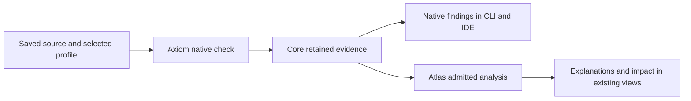

# Axiom and Atlas: from native checks to explainable change

Status: proposed product direction. This document describes the intended
integration, not an installed capability or release qualification. Atlas MVP
readiness and integration readiness are separate workstreams.

## Vision

A developer should be able to save a pack edit and answer four questions from
Workbench: **Did it execute? What took effect? What changed? What depends on it?**

Axiom supplies observations from original native initialization. Atlas connects
those observations to source, materials, recipes, machines, and dependencies.
Together they should explain a change in terms a developer can act on, with a
short route back to exact evidence and saved source.

The first audience is a Supersymmetry developer using the selected Cleanroom
profile. Pack rules remain explicit so other profiles can supply their own
interpretation. The experience belongs in **Review → Change → Diagnose**, through
the CLI, VS Code, and IntelliJ Community.

The release objective is useful, independently qualified modules. Atlas should
be able to ship admitted knowledge workflows while its Axiom integration
advances separately. Neither module needs every future analysis feature to
become useful.

## The developer experience

A saved check first presents Axiom's native outcome, original findings, checked
scope, and source navigation. Atlas adds explanations when the required evidence
is ready. Developers can continue working while derived analysis runs; an
unfinished Atlas analysis does not replace a native result with a spinner.

These are target experiences, not claims about current integration:

| Situation | Useful explanation | Required evidence |
| --- | --- | --- |
| A declaration executes but recipe insertion fails | Which operation failed, the original reason if observed, and any observed competing recipe | Execution, insertion result, operation identity, and relevant registry state |
| Recycling outputs vary between unchanged runs | Which outputs or durations changed, whether selection or only order changed, and affected consumers | Compatible repeated captures, supported comparison semantics, and dependency observations |
| A later operation removes or replaces a recipe | The sequence from registration to removal/replacement and the final state | Ordered operation occurrences and state transitions |
| An output loses an observed producer | Alternative observed producers, affected recipes, and relevant quest definitions | Complete evidence within the reported query scope, including lookup activity |
| An answer crosses an unobserved boundary | The missing observation and the next useful check | Explicit coverage and a traceable unresolved boundary |

Explanations lead with the finding and relevant values, then offer the supporting
operation, source, or dependency path. Native errors and Atlas analysis have
separate owners and counts. A dependency exposure is not automatically another
compiler error.

For example, the intended failed-insertion experience is:

> The declaration executed, but this recipe was not inserted into the observed
> lookup structure. Open the recorded insertion result and the recipe that
> occupies the conflicting path.

If the original evidence does not identify a conflicting recipe, the explanation
stops at failed insertion. Source similarity cannot fill that gap.

## Ownership and composition

| Owner | Responsibility |
| --- | --- |
| Axiom | Original native execution and diagnostics; passive observation of admitted operations, registration state, and applicable lookup behavior |
| Atlas | Admission of evidence for its analyses; comparison interpretation; provenance paths; bounded dependency and impact analysis; explicit uncertainty |
| Core | Process/service lifecycle; saved-source and output capture; immutable storage; scheduling, cancellation, recovery, retention, and reclamation |
| Platform and pack profiles | Selected artifacts, JVM, side, lifecycle context, domain policies, and interpretation adapters |
| Workbench Shell and clients | Compose registered capabilities and present consistent results with their revision, source, scope, and owner |
| Crucible | Controlled game/runtime experiments and their evidence when a question exceeds Axiom's admitted initialization scope |

The native worker remains the execution authority. Atlas does not replay
registration algorithms, reconstruct favorable registry state, or change native
severity. Core does not acquire recipe semantics. Clients do not implement a
second comparator. Reading an Axiom result must not implicitly launch Minecraft.

Axiom remains usable when Atlas is absent, incompatible, or disabled. Atlas
continues to accept its other admitted evidence sources. Dependency changes must
remain explicit and acyclic. This vision does not assume Atlas currently has no
dependencies on other Workbench packages.

## Evidence that makes explanations trustworthy

A versioned admission contract must preserve Axiom's actual initialization phase
and scope. It must not relabel initialization as a post-start game capture to
satisfy an older reader.

An admitted result needs:

- Saved source/configuration digest, selected artifacts, runtime/JVM identity,
  profile, physical side, producer version, and lifecycle checkpoint.
- Observation schema and interpretation-policy versions, with coverage stated
  per domain and operation rather than inferred from command success.
- Exact run-local operation occurrences, owners, source bindings where available,
  lifecycle ordering, original returns, and observed state endpoints.
- Distinct evidence for declaration, execution, validation, scripted/category
  presence, lookup membership, lookup selection, and final retained state.
- Original evidence references and any failure, ambiguity, incomplete capture,
  or unsupported callback that affects the answer.

Capture identity, recipe content identity, and cross-run correspondence are
separate concepts. A content hash does not establish that two different hashes
belong to one changed recipe. A source line can move, a helper can register many
recipes, and generated objects can share a declaration. Authoritative
correspondence needs an explicit occurrence/derivation contract. Until one
applies, Atlas reports additions, removals, or candidate correspondence without
turning a heuristic pairing into a proven edit.

Source causation also requires an experiment binding. Baseline and candidate
observations must retain their saved inputs and the controlled change being
evaluated. Equal counts or matching names do not prove that an edit caused a
runtime delta.

## Understanding variance without hiding defects

Atlas should provide domain-aware interpretation alongside unchanged raw
captures. The explanation distinguishes:

| Difference | Intended treatment |
| --- | --- |
| Representation or reference numbering | Compare resolved values while preserving aliases under a documented contract |
| Generated identity or lazy cache state | Explain the specific field and rule; retain the original value |
| Output, quantity, duration, or other recipe content | Report the concrete change |
| Slot, registry, or matching precedence | Preserve order; assess significance only where supported |
| Unsupported semantics or incompatible context | Remain unresolved or incomparable, with a reason |

There is no universal rule to sort arrays, discard UUIDs, or ignore NBT order.
Output slots, duplicates, strict NBT matching, aliases, and first-match selection
can affect behavior. Each interpretation rule needs a named domain, version, and
evidence showing which meaningful changes it preserves.

Repeated identical-input controls establish observed variation before an edited
run is interpreted. Known native nondeterminism remains visible. A genuine
output change must not disappear merely to make repeatability checks pass.

## Coverage as a product feature

The integration should expose coverage by recipe family, material domain,
lifecycle stage, and operation where those distinctions matter. Stored inventory
coverage and executed lookup coverage remain separate.

The first useful expansion is original registration outcome evidence:
validation, insertion, removal, replacement, and final membership. Selected
lookup observations can then resolve competing recipes and precedence.
World-dependent callbacks remain outside the answer until the required runtime
evidence is supplied through its proper owner.

Atlas can show where a source-to-result path stops and connect a confirmed
change to observed producers, consumers, machines, and quest definitions. It
cannot infer an unobserved producer, prove player reachability, or classify every
missing record as a missing dependency. Structural exposure and native failure
remain different findings.

Expansion should add the observation or dependency needed to answer a named
developer question, then qualify that scope. Adding every mod or analysis domain
is not the coverage strategy.

## Fast delivery and managed history

Reuse Core's captured output and immutable snapshots. Atlas reads a sealed,
admitted revision through supported readers without causing a second native
run or repeatedly transporting and decoding the full capture. Reuse existing
graph/query abstractions where their meanings apply, with new scope/version
rules where they do not.

Native findings remain the first actionable delivery. Atlas explanations arrive
as separate revision-bound results and cannot overwrite another selected run.
Queries for one finding or neighborhood should hydrate only necessary sections.
Large traversals remain cancellable and disclose unexplored boundaries.

Reusable derived sections must be keyed by their actual inputs: source section
identity, observation semantics, interpreter/profile policy, and dependencies.
Unchanged bytes are reusable only when their meaning is unchanged. Historical
results can remain available as historical evidence; they must not appear as
current answers while verification is pending.

Indexes, graph projections, and analyses are derived resources managed through
Core's existing lifecycle. Shared objects are counted once, and analysis
references retain required evidence. Users should be able to inspect disk use,
retain selected results, remove derived indexes, and preview reclaimable history.
Cache rebuilding must not modify raw evidence. Module removal follows the
declared retention policy rather than silently deleting user evidence or leaving
an invisible second history store.

Performance evidence distinguishes native execution, first visible finding,
verified source navigation, first Atlas explanation, full analysis, cache reuse,
peak memory, and retained disk growth. This vision introduces no numeric
performance promise or reinstated MVP resource target. Thresholds belong in a
separately reviewed qualification plan.

## Existing foundations and integration gaps

Atlas already provides recipe search, impact and proposed-change analysis,
immutable graph readers with derived indexes, material lenses, and validated
provenance normalization/query contracts. Axiom supplies original native
initialization observations, immutable retained results, and diagnostic delivery
before full snapshot finalization. These are reusable foundations.

The integration still needs explicit Axiom evidence admission, relevant native
operation observations, supported cross-run correspondence, variance
interpretation, and qualified end-to-end presentation. The current Atlas runtime
recipe comparator requires a complete `post-start-end-tick` GT capture and does
not publish changed-recipe correspondence. Its existing format must retain those
semantics. Provenance fixtures demonstrate contract behavior; they do not prove
that corresponding production transitions have been captured.

Independently surviving background analysis is a delivery objective, not a claim
supplied by the current Axiom diagnostic-delivery implementation.

## Separate routes to the first release

**Atlas MVP** establishes a useful, installable knowledge module over admitted
inputs. Its separate readiness effort should select a coherent initial workflow,
reconcile implemented versus qualified capabilities, identify required package,
profile, and client dependencies, and verify the installed experience. Recipe
search, inspection, bounded impact, and trustworthy evidence navigation are a
candidate focus, not a declaration of final MVP scope. Existing material and
other domains should be assessed on their own evidence rather than silently
discarded or made mandatory by this document.

**Axiom–Atlas integration** adds explanations over native checks. Its first
product increment should make retained Axiom results admissible and inspectable
without changing their scope. Subsequent increments add variance interpretation,
registration provenance, and downstream impact. Each increment needs an explicit
supported boundary and may remain unavailable while other Atlas workflows ship.

Workbench's first release can compose qualified modules and supported version
combinations. More modules should mean more dependable developer workflows, not
more advertised schemas. Packaging Atlas with dependencies is distinct from
qualifying every capability those packages contain. Module versions,
installation decisions, compatibility records, and release decisions remain
independent under the existing component release model.

This vision neither starts Atlas MVP implementation nor makes the full
integration a first-release gate. The next separate Atlas effort should produce
its readiness assessment, proposed MVP boundary, remaining work, and acceptance
criteria before implementation proceeds.

## What success looks like

A developer can explain a failed or changed recipe faster, with fewer unsupported
assumptions, from the same saved-check workflow. Representative acceptance should
cover silent insertion failure, output-slot cutoff variance, order-sensitive
lookup, generated/cache differences, and removal/replacement across the established
range of machine capabilities.

The same result retains its meaning through the CLI and both IDEs. Missing
Atlas, incompatible evidence, interrupted analysis, changed source, stale caches,
and reclaimed history produce understandable states. Native errors stay visible,
evidence stays inspectable, and analysis does not delay first actionable delivery
or create unaccounted storage growth.

## Related contracts

- [Axiom MVP scope](../../modules/axiom/spec/initialization-mvp.md)
- [Axiom diagnostic delivery](../architecture/AXIOM-DIAGNOSTIC-DELIVERY.md)
- [Core and module ownership](../architecture/CORE-AND-MODULES.md)
- [Atlas recipe impact](../../modules/atlas/contracts/atlas-recipe-impact-report-v1.md)
- [Atlas runtime comparison](../../modules/atlas/contracts/atlas-runtime-recipe-comparison-v1.md)
- [Atlas provenance normalization](../../modules/atlas/contracts/atlas-runtime-provenance-normalization-v1.md)
- [Atlas causal query](../../modules/atlas/contracts/atlas-causal-query-v1.md)
- [Component releases](../../packaging/release/README.md)
